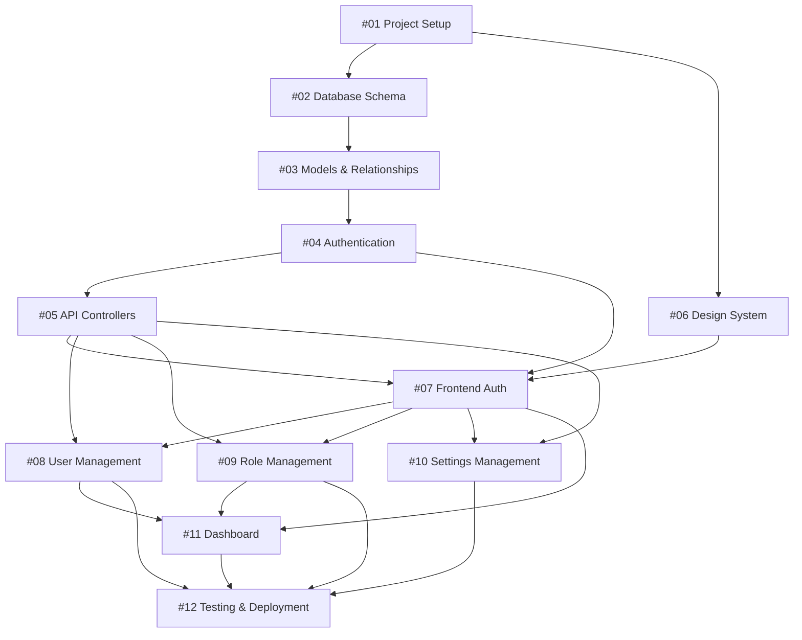

# Phase 1 Implementation Timeline and Dependencies
## Banrimkwae Resort Management System

### Table of Contents
1. [Timeline Overview](#timeline-overview)
2. [Dependency Mapping](#dependency-mapping)
3. [Critical Path Analysis](#critical-path-analysis)
4. [Resource Allocation](#resource-allocation)
5. [Milestone Planning](#milestone-planning)
6. [Risk Assessment](#risk-assessment)
7. [Parallel Development Opportunities](#parallel-development-opportunities)
8. [Quality Gates](#quality-gates)

---

## Timeline Overview

### 📅 Project Duration
- **Total Estimated Time**: 186-226 hours
- **Development Timeline**: 8-10 weeks (1 developer)
- **Team Timeline**: 4-5 weeks (2-3 developers)
- **Start Date**: [To be determined]
- **Target Completion**: [To be determined]

### 🏃‍♂️ Sprint Breakdown (2-week sprints)

#### Sprint 1: Foundation Setup (Weeks 1-2)
**Goal**: Establish development environment and core infrastructure
- Issues: #01, #02, #03
- Estimated: 30-37 hours
- Deliverables: Working development environment, database schema, basic models

#### Sprint 2: Authentication & API Layer (Weeks 3-4)
**Goal**: Implement secure authentication and API foundation
- Issues: #04, #05, #06
- Estimated: 42-53 hours
- Deliverables: Authentication system, API endpoints, design system

#### Sprint 3: Frontend Core Features (Weeks 5-6)
**Goal**: Build main frontend interfaces and user management
- Issues: #07, #08
- Estimated: 40-48 hours
- Deliverables: Login system, user management interface

#### Sprint 4: Administrative Features (Weeks 7-8)
**Goal**: Complete role management, settings, and dashboard
- Issues: #09, #10, #11
- Estimated: 54-66 hours
- Deliverables: Role management, settings panel, analytics dashboard

#### Sprint 5: Testing & Deployment (Weeks 9-10)
**Goal**: Comprehensive testing and production deployment
- Issues: #12
- Estimated: 18-22 hours
- Deliverables: Test suite, CI/CD pipeline, production deployment

---

## Dependency Mapping

### 🔗 Issue Dependencies



### 📋 Detailed Dependency Matrix

| Issue | Direct Dependencies | Estimated Start | Duration | Estimated Completion |
|-------|-------------------|-----------------|----------|---------------------|
| #01 | None | Week 1, Day 1 | 8-10h | Week 1, Day 2 |
| #02 | #01 | Week 1, Day 2 | 12-15h | Week 1, Day 4 |
| #03 | #02 | Week 1, Day 4 | 10-12h | Week 2, Day 1 |
| #04 | #03 | Week 2, Day 1 | 12-15h | Week 2, Day 3 |
| #05 | #04 | Week 2, Day 3 | 16-20h | Week 3, Day 1 |
| #06 | #01 | Week 1, Day 2 | 14-18h | Week 2, Day 2 |
| #07 | #04, #06 | Week 3, Day 1 | 16-20h | Week 3, Day 4 |
| #08 | #05, #07 | Week 3, Day 4 | 24-28h | Week 4, Day 4 |
| #09 | #05, #07 | Week 3, Day 4 | 18-22h | Week 4, Day 3 |
| #10 | #05, #07 | Week 3, Day 4 | 16-20h | Week 4, Day 3 |
| #11 | #07, #08, #09 | Week 4, Day 4 | 20-24h | Week 5, Day 3 |
| #12 | All Previous | Week 5, Day 3 | 18-22h | Week 6, Day 1 |

---

## Critical Path Analysis

### 🚨 Critical Path (Longest Dependency Chain)
**Path**: #01 → #02 → #03 → #04 → #05 → #07 → #08 → #11 → #12
**Total Duration**: 138-172 hours (Critical path represents 74-76% of total work)

### ⚡ Critical Path Milestones
1. **Infrastructure Ready** (End of Week 1): Issues #01, #02 complete
2. **Backend Foundation** (End of Week 2): Issues #03, #04, #05 complete
3. **Frontend Authentication** (Mid Week 3): Issue #07 complete
4. **User Management Live** (End of Week 4): Issue #08 complete
5. **Dashboard Operational** (End of Week 5): Issue #11 complete
6. **Production Ready** (End of Week 6): Issue #12 complete

### 🎯 Critical Success Factors
- **Database Schema Approval**: Must be finalized before backend development
- **API Contract Definition**: Frontend/backend teams need clear API specifications
- **Authentication System**: Blocks all frontend feature development
- **Design System**: Required for consistent UI implementation

---

## Resource Allocation

### 👥 Team Structure Options

#### Option A: Single Full-Stack Developer
```
Timeline: 8-10 weeks
Pros: 
- Consistent code style
- No communication overhead
- Deep system knowledge
Cons:
- Longer timeline
- Single point of failure
- Limited expertise diversity
```

#### Option B: Frontend + Backend Specialists
```
Timeline: 5-6 weeks
Backend Developer: Issues #01-#05, #12 (backend portions)
Frontend Developer: Issues #06-#11, #12 (frontend portions)
Overlap Period: Weeks 3-4 for integration
```

#### Option C: Full Team (Recommended)
```
Timeline: 4-5 weeks
Tech Lead: Architecture, code reviews, Issue #01
Backend Developer: Issues #02-#05
Frontend Developer: Issues #06-#11
DevOps Engineer: Issue #12
QA Engineer: Testing across all issues
```

### 📊 Skill Requirements

| Skill | Issues Requiring | Priority | Hours Needed |
|-------|-----------------|----------|--------------|
| Laravel/PHP | #01-#05, #12 | High | 80-95h |
| React/TypeScript | #06-#11, #12 | High | 88-110h |
| Database Design | #02, #03 | Medium | 20-25h |
| DevOps/CI-CD | #01, #12 | Medium | 25-30h |
| UI/UX Design | #06-#11 | Medium | 60-75h |
| Testing | #12 | High | 18-22h |

---

## Milestone Planning

### 🏁 Major Milestones

#### Milestone 1: Infrastructure Complete (End Week 2)
**Deliverables:**
- Development environment operational
- Database schema implemented and tested
- Laravel models with relationships
- Basic authentication system functional

**Success Criteria:**
- All migrations run successfully
- Model relationships tested
- JWT authentication working
- API endpoints return valid responses

#### Milestone 2: Backend API Complete (End Week 3)
**Deliverables:**
- All API endpoints implemented
- Authentication middleware working
- Role-based access control functional
- API documentation complete

**Success Criteria:**
- Postman/Insomnia collection works
- All endpoints return proper status codes
- Permission system blocks unauthorized access
- API follows RESTful conventions

#### Milestone 3: Frontend Foundation (End Week 4)
**Deliverables:**
- Design system implemented
- Authentication flow working
- User management interface functional
- Protected routes operational

**Success Criteria:**
- Users can login/logout successfully
- Protected pages require authentication
- User CRUD operations work
- UI follows design specifications

#### Milestone 4: Administrative Features (End Week 5)
**Deliverables:**
- Role management interface
- Settings management panel
- Dashboard with analytics
- All core features integrated

**Success Criteria:**
- Admins can manage roles and permissions
- System settings can be modified
- Dashboard displays real-time data
- All features work together seamlessly

#### Milestone 5: Production Ready (End Week 6)
**Deliverables:**
- Comprehensive test coverage
- CI/CD pipeline operational
- Production deployment successful
- Monitoring and logging active

**Success Criteria:**
- All tests pass consistently
- Deployment process automated
- Application performance meets requirements
- Error tracking and monitoring functional

---

## Risk Assessment

### 🚨 High-Risk Dependencies

#### Database Schema Changes
**Risk Level**: High
**Impact**: Could require rework of models and API
**Mitigation**: 
- Thorough review process for schema design
- Create comprehensive ER diagrams
- Validate with stakeholders before implementation

#### Authentication Integration
**Risk Level**: High
**Impact**: Blocks all frontend development
**Mitigation**:
- Implement authentication early
- Create mock authentication for frontend development
- Parallel development of auth components

#### API Contract Changes
**Risk Level**: Medium
**Impact**: Frontend/backend integration issues
**Mitigation**:
- Define API contracts early
- Use OpenAPI/Swagger documentation
- Implement contract testing

### ⚠️ Medium-Risk Dependencies

#### Design System Completion
**Risk Level**: Medium
**Impact**: Inconsistent UI implementation
**Mitigation**:
- Start design system early
- Create component library incrementally
- Regular design reviews

#### Third-Party Library Updates
**Risk Level**: Medium
**Impact**: Breaking changes in dependencies
**Mitigation**:
- Lock dependency versions
- Regular dependency audits
- Maintain update schedule

### 📋 Risk Mitigation Strategies

1. **Parallel Development Tracks**
   - Frontend and backend teams work simultaneously
   - Use mocked APIs for frontend development
   - Implement contract testing

2. **Frequent Integration Points**
   - Daily integration testing
   - Weekly demo sessions
   - Continuous deployment to staging

3. **Fallback Plans**
   - Simplified UI fallbacks for complex components
   - Alternative authentication methods
   - Reduced scope options for each feature

---

## Parallel Development Opportunities

### 🔄 Concurrent Work Streams

#### Stream 1: Backend Development
**Timeline**: Weeks 1-3
**Team**: Backend Developer
**Work**: Issues #01-#05
```
Week 1: #01 (Setup) + #02 (Database)
Week 2: #03 (Models) + #04 (Auth)
Week 3: #05 (API Controllers)
```

#### Stream 2: Frontend Foundation
**Timeline**: Weeks 1-3
**Team**: Frontend Developer
**Work**: Issue #06 + preparation for #07-#11
```
Week 1: Project setup + design system planning
Week 2: #06 (Design System implementation)
Week 3: Component library + mock integrations
```

#### Stream 3: DevOps Preparation
**Timeline**: Weeks 1-6
**Team**: DevOps Engineer
**Work**: Issue #12 (infrastructure portions)
```
Week 1-2: CI/CD pipeline setup
Week 3-4: Docker configuration
Week 5-6: Deployment automation + monitoring
```

### ⚡ Integration Points

#### Week 3: First Integration
- Backend API ready for testing
- Frontend authentication components ready
- **Goal**: Working login flow

#### Week 4: Feature Integration
- User management backend complete
- Role management API ready
- **Goal**: Full user administration

#### Week 5: Final Integration
- All features implemented
- Dashboard connected to real data
- **Goal**: Complete system integration

---

## Quality Gates

### 🔍 Quality Checkpoints

#### Code Quality Gates
**Frequency**: Every commit
**Automated Checks**:
- Linting (ESLint, PHP CS Fixer)
- Type checking (TypeScript)
- Unit test coverage >80%
- Security vulnerability scans

#### Integration Quality Gates
**Frequency**: Every feature completion
**Manual Checks**:
- API contract compliance
- UI/UX review against wireframes
- Cross-browser compatibility
- Mobile responsiveness

#### Milestone Quality Gates
**Frequency**: End of each milestone
**Comprehensive Review**:
- Performance testing
- Security penetration testing
- Accessibility compliance (WCAG 2.1)
- User acceptance testing

### 📊 Success Metrics

#### Technical Metrics
- **Test Coverage**: ≥80% for both frontend and backend
- **Performance**: API response time <200ms
- **Security**: No critical vulnerabilities
- **Accessibility**: WCAG 2.1 AA compliance

#### Functional Metrics
- **Feature Completeness**: 100% of wireframe requirements
- **Data Integrity**: All CRUD operations working correctly
- **User Experience**: Login flow <3 clicks
- **System Reliability**: 99.9% uptime target

#### Quality Metrics
- **Code Review**: 100% of code reviewed before merge
- **Documentation**: All APIs documented
- **Error Handling**: Graceful degradation for all error scenarios
- **Monitoring**: All critical paths monitored

---

## Conclusion

This timeline and dependency analysis provides a structured approach to Phase 1 implementation. The critical path analysis identifies the most important dependencies, while the parallel development opportunities allow for optimized resource utilization.

### Key Success Factors:
1. **Early Infrastructure Setup**: Foundation must be solid
2. **Clear API Contracts**: Enable parallel frontend/backend development
3. **Regular Integration**: Prevent integration issues
4. **Quality Focus**: Maintain high standards throughout
5. **Risk Management**: Proactive identification and mitigation

### Recommended Approach:
- **Team Size**: 3-4 developers for optimal timeline
- **Timeline**: 4-5 weeks with proper team coordination
- **Quality Gates**: Implement automated checks from day one
- **Communication**: Daily standups and weekly integration reviews

---

*Last Updated: December 2024*
*Version: 1.0.0*
